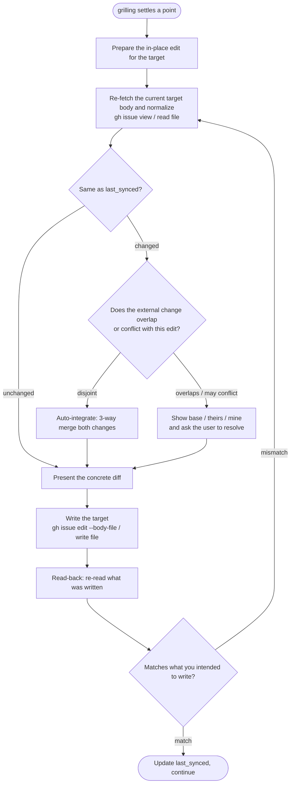

# Kabeuchi — Grill a spec, write the conclusions back into it

Run a relentless interview about a target markdown document and, **every time a point is settled, reflect that conclusion back into the target in place** — so the target is never a log of the discussion but always a clean spec of the current agreed state.

This is a **thin delegation wrapper over `/grilling`**. It is the same shape as `grill-with-docs` (which runs `/grilling` and feeds the result into `/domain-modeling` to produce ADRs and a glossary), except the artifact is replaced: instead of separate ADR/glossary docs, the artifact is **the target markdown itself**. The interview tone — one question at a time, unrelenting, always with a recommended answer — is **not re-implemented here; it is delegated to `/grilling`**. This skill adds only two things on top: reading/writing the target, and handling concurrent edits safely.

## Usage

```
/kabeuchi <target>
```

`<target>` must be **writable markdown**. Exactly two kinds are supported (v1):

- **A GitHub issue URL** — `https://github.com/<owner>/<repo>/issues/<N>`, any repo you can reach via `gh`. The **issue body only** is the target; comments are never read and never posted.
- **A local markdown file path** — resolved relative to the current working directory.

Out of scope for v1 (reject these): arbitrary web URLs, GitHub **PR** bodies, Gists, and bare issue-number shorthand.

`$ARGUMENTS` is the target. If it matches `https://github.com/.../issues/<N>` treat it as a GitHub issue; otherwise treat it as a local markdown path.

## Requires `/grilling`

kabeuchi delegates the entire interview to the **`/grilling`** skill and does **not** bundle it. It is referenced, not vendored.

**Preflight:** at startup, confirm `/grilling` is available. If it is not, **stop and tell the user how to install it** — do not silently fall back to an ad-hoc interview. `/grilling` is a standalone skill (the relentless, one-question-at-a-time design interview); install it into your skills directory before running kabeuchi.

## Phase 1: Resolve the target and run preflight

Classify the target, then verify you can actually **write** it before spending the session. The whole point of the preflight is to avoid the failure mode of grilling for an hour and only then discovering the conclusions cannot be saved.

### GitHub issue target

Read the body and metadata (body only — never touch comments):

```bash
gh issue view "$URL" --json body,state,closed,url --jq '{state, closed, url}'
gh issue view "$URL" --json body --jq .body        # the target body
```

Check writability and lock state up front:

```bash
gh api "repos/OWNER/REPO"          --jq .permissions.push   # can I write?  (true/false)
gh api "repos/OWNER/REPO/issues/N" --jq .locked             # is it locked? (true/false)
```

(`gh issue view --json` has no `locked` field, so read `locked` via the REST API.)

### Local file target

If the file exists, read it. If it does not, ask whether to create it (a from-scratch spec is a legitimate use). Reject anything that is not text markdown (binary / non-markdown).

### Edge cases (decide before interviewing)

| Case | Behavior |
|---|---|
| Issue 404 / not readable | Abort immediately with an explicit message. |
| Readable but not writable (`permissions.push = false`) | Detected by the startup preflight → abort. If the user only wants a read-only session, tell them to use `/grilling` directly. |
| Issue locked **and** not writable | Abort; state that editing is impossible. |
| Issue closed **but** writable | Continue, but warn that the issue is closed. |
| Local file does not exist | Ask whether to create it from scratch. If no, abort. |
| Non-markdown / binary target | Reject. |
| Target is empty (empty issue body / brand-new file) | Enter **from-scratch mode**: build the spec through grilling. |

### Establish the sync baseline

Keep the **normalized** target body you last agreed on as `last_synced`. This is both the change detector and the **merge base** for conflict resolution, so retain the actual normalized body text — not only a hash. A SHA256 of it is a convenient equality shortcut, but the 3-way merge in Phase 2 needs the baseline *text*, so a hash alone is not enough:

```bash
# normalize: LF line endings, strip trailing whitespace/newlines from the whole body
printf '%s' "$normalized_body" | shasum -a 256   # quick equality check; keep the body text too
```

**Normalization is mandatory** on every read, comparison, and read-back. GitHub appends a trailing newline to issue bodies, so without normalizing trailing whitespace/newlines your own writes will look like external "conflicts" on the very next check. Normalization makes the comparison a deterministic comparison of body content, not formatting noise.

## Phase 2: Grill, and reflect each conclusion in place

Run `/grilling` on the target. Follow its conventions exactly — one question at a time, wait for the answer before the next, always offer your recommended answer, prefer exploring the codebase over asking when the answer is discoverable there. Do not re-implement or soften that tone here.

**Each time a point is settled**, reflect it into the target with the write-back loop below. Reflection means **rewriting the target in place** into the current agreed spec — an `Edit`-style overwrite of the affected section — **not** appending, not keeping a changelog, not logging the Q&A. Before every write, **present the concrete diff**; if the user objects, roll it back.



### Conflict handling: optimistic detection, conservative resolution, no locks

Other terminals, or a human editing the issue in a browser or the file in an editor, may change the target underneath you. Handle it the way `git` merges non-conflicting hunks — never take a lock (an issue body has nowhere to store one, and a crashed terminal would leave it stale).

- **Detect (optimistic).** Immediately before writing, re-fetch the target, normalize, and compare it to `last_synced` (a SHA256 equality check is a fine shortcut). Equal → no external change. Different → an external change happened.
- **Resolve (conservative).** Detection is optimistic; resolution is not. Do a **3-way merge** with `base` = the retained `last_synced` body, `theirs` = the current external body, `mine` = the body with your edit applied. Write the three normalized bodies to temp files and merge:

  ```bash
  git merge-file -p mine.md base.md theirs.md > merged.md   # exit 0 = clean, non-zero = conflict markers
  ```

  (`git merge-file` is a pure text-merge utility — it reads three files and touches no repository.)

  - **Clean merge (disjoint):** the external change and your edit do not overlap → auto-integrate `merged.md`. When you present the diff, **call out the external change you folded in**, so the user is not surprised by an edit they did not make in this session.
  - **Conflict (overlapping / possibly contradictory):** **do not auto-resolve.** Show the user `base`, `theirs`, and `mine` (or the marked-up merge) and have them resolve it before writing.

- **Verify (read-back).** The issue API has no conditional update (no If-Match / CAS), so an interruption between fetch and write cannot be prevented outright. After writing, **read the target back**, normalize, and compare it to what you intended to write (the merged body, if you merged). Match → set `last_synced` to that written body and continue. Mismatch → someone wrote in between; loop back to re-fetch and re-judge.

### Writing the target

- **GitHub issue:** `gh issue edit "$URL" --body-file <file>` (use `--body-file`, not `--body`, to preserve exact content).
- **Local file:** write the file. kabeuchi performs **no git operations** — no `add`, no `commit`, no `push`. It leaves the edited working tree; committing is the user's call.

## Phase 3: Finish

- **Keep going until the user confirms** a shared understanding has been reached — the standard `/grilling` exit condition. Do not enact anything beyond updating the target.
- **Summarize what was written back** to the target at the end.
- **Do not wander** into adjacent work on your own initiative.
- The target must contain **only the current agreed state** — never a change-history or discussion-log section.

## Non-goals (v1)

- No `scripts/` or `tests/`. kabeuchi is a prompt-driven delegation wrapper; there is no code to unit-test.
- No comment I/O on issues, no PR/Gist/arbitrary-URL targets, no issue-number shorthand.
- No git side effects on local files.
