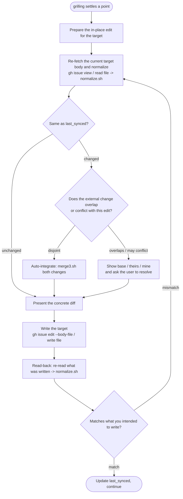

# Conflict resolution and the write-back loop

Read this when you are in Phase 2 and about to reflect a settled point back into
the target. It expands the "optimistic detect, conservative resolve, no locks"
rule and shows exactly how to drive `scripts/normalize.sh` and
`scripts/merge3.sh`.

## The sync baseline

Keep the **normalized** target body you last agreed on as `last_synced`. This is
both the change detector and the **merge base** for conflict resolution, so
retain the actual normalized body *text* — not only a hash. A SHA256 of it is a
convenient equality shortcut, but the 3-way merge below needs the baseline text,
so a hash alone is not enough.

```bash
# canonical form + a cheap equality key for the quick "did it change?" check
normalize.sh "$body_file" | tee last_synced.txt | shasum -a 256
```

**Normalization is mandatory** on every read, comparison, and read-back — always
via `scripts/normalize.sh`, never ad hoc. GitHub appends a trailing newline to
issue bodies, so without normalizing trailing whitespace/newlines your own
writes look like external "conflicts" on the very next check. Normalization
makes the comparison a deterministic comparison of body *content*, not
formatting noise. See `gotchas.md` for the details.

## The write-back loop

Each time `/grilling` settles a point, reflect it into the target with this
loop. Reflection means **rewriting the target in place** into the current agreed
spec — an `Edit`-style overwrite of the affected section — **not** appending, not
keeping a changelog, not logging the Q&A. Before every write, **present the
concrete diff**; if the user objects, roll it back.



## Detect, resolve, verify

Other terminals, or a human editing the issue in a browser or the file in an
editor, may change the target underneath you. Handle it the way `git` merges
non-conflicting hunks — **never take a lock** (an issue body has nowhere to
store one, and a crashed terminal would leave it stale).

- **Detect (optimistic).** Immediately before writing, re-fetch the target,
  normalize it, and compare to `last_synced` (a SHA256 equality check is a fine
  shortcut). Equal → no external change. Different → an external change
  happened.

- **Resolve (conservative).** Detection is optimistic; resolution is not. Run a
  **3-way merge** with `base` = the retained `last_synced` body, `mine` = the
  body with your edit applied, `theirs` = the current external body:

  ```bash
  merge3.sh last_synced.txt mine.txt theirs.txt > merged.txt
  case $? in
    0) : ;;   # clean, disjoint  -> use merged.txt
    1) : ;;   # conflict          -> markers in merged.txt; a human must resolve
    *) : ;;   # usage/internal    -> abort
  esac
  ```

  `merge3.sh` normalizes all three inputs, merges them in a private temp dir,
  and cleans up after itself — it leaves nothing in your working tree.

  - **Clean merge (exit 0, disjoint):** the external change and your edit do not
    overlap → auto-integrate `merged.txt`. When you present the diff, **call out
    the external change you folded in**, so the user is not surprised by an edit
    they did not make in this session.
  - **Conflict (exit 1, overlapping / possibly contradictory):** **do not
    auto-resolve.** Show the user `base`, `theirs`, and `mine` (or the marked-up
    `merged.txt`) and have them resolve it before writing.

- **Verify (read-back).** The issue API has no conditional update (no If-Match /
  CAS), so an interruption between fetch and write cannot be prevented outright.
  After writing, **read the target back**, normalize it, and compare to what you
  intended to write (the merged body, if you merged). Match → set `last_synced`
  to that written body and continue. Mismatch → someone wrote in between; loop
  back to re-fetch and re-judge.

## Writing the target

- **GitHub issue:** `gh issue edit "$URL" --body-file <file>` — use
  `--body-file`, not `--body`, to preserve exact content.
- **Local file:** write the file. kabeuchi performs **no git operations** — no
  `add`, no `commit`, no `push`. It leaves the edited working tree; committing is
  the user's call.
